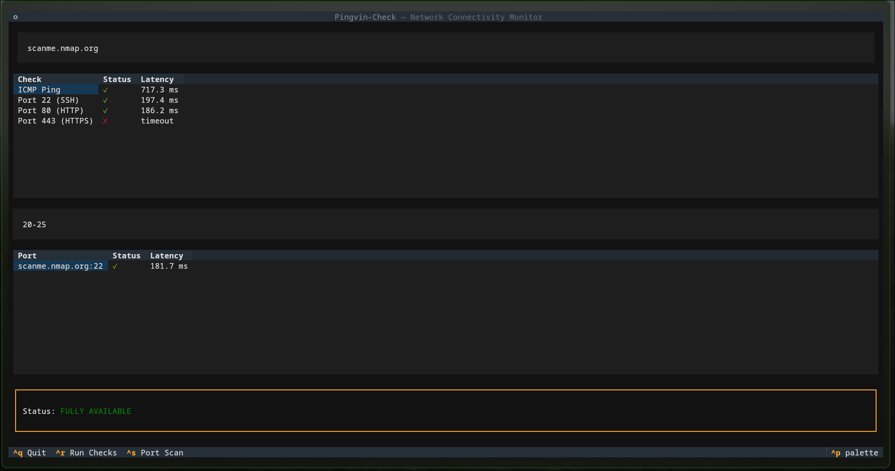
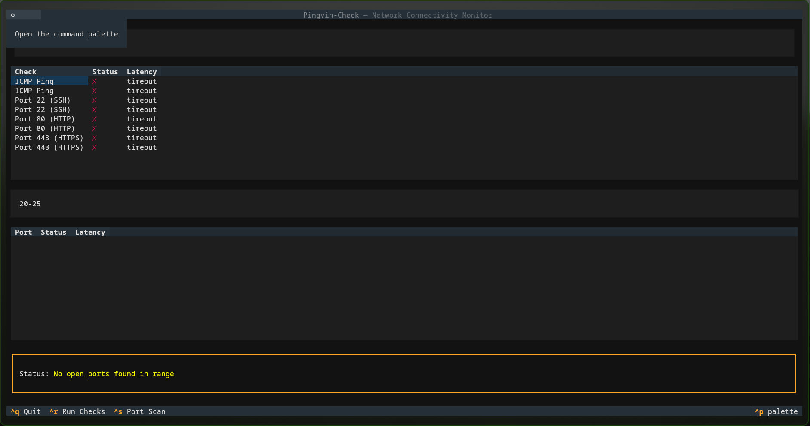

# 🐧 Pingvin-Check

```text
██████╗ ██╗███╗   ██╗ ██████╗ ██╗   ██╗██╗███╗   ██╗
██╔══██╗██║████╗  ██║██╔════╝ ██║   ██║██║████╗  ██║
██████╔╝██║██╔██╗ ██║██║  ███╗██║   ██║██║██╔██╗ ██║
██╔═══╝ ██║██║╚██╗██║██║   ██║██║   ██║██║██║╚██╗██║
██║     ██║██║ ╚████║╚██████╔╝╚██████╔╝██║██║ ╚████║
╚═╝     ╚═╝╚═╝  ╚═══╝ ╚═════╝  ╚═════╝ ╚═╝╚═╝  ╚═══╝
             C H E C K   +   S C A N
```
> A lightweight network connectivity checker.

**v0.5.0**

Pingvin-Check verifies whether the internet is reachable using two methods: **ICMP ping** and **TCP connection** to multiple public DNS servers (Cloudflare, Google, Yandex, Quad9, OpenDNS). If ICMP is blocked by a firewall, the TCP fallback still gives you a reliable answer.

## Features

- **ICMP ping** — standard host reachability check
- **TCP connection check** — fallback across multiple public DNS servers
- **Port scanning** — scan a range of TCP ports on a target host
- **Interactive TUI** — Textual-based terminal interface for live checks
- **Latency measurement** — response time tracking in milliseconds
- **JSON output** — machine-readable output for use in scripts/pipelines
- **Logging** — internal debug logs showing which checks succeeded/failed
- **Tests** — unit tests covering success and failure scenarios (with mocking)

## Screenshots

**Host reachable — full network check + port scan**


**Host unreachable — TEST-NET address**


## Installation

```bash
git clone https://github.com/pvyle0/pingvin-check.git
cd pingvin-check
pip install -e .
pip install textual
```

## Usage

Launch the interactive TUI:

```bash
python3 -m pingvin.tui
```

Enter a target host to run ICMP ping + common port checks (SSH, HTTP, HTTPS), or enter a port range (e.g. `1-1024`) to run a full port scan — results show up in separate tables with live status.

Check default connectivity (Google DNS):

```bash
python main.py
```

Check a specific host/port:

```bash
python main.py --host 1.1.1.1 --port 53
```

Get machine-readable JSON output:

```bash
python main.py --format json
```

Scan a port range on a host:

```bash
python main.py --host scanme.nmap.org --scan --start-port 20 --end-port 25
```

*(only scan hosts you're authorized to test)*

### Options

| Flag           | Description                                | Default   |
|----------------|---------------------------------------------|-----------|
| `--host`       | Target host to check/scan                  | `8.8.8.8` |
| `--port`       | TCP port to connect to (single check)       | `53`      |
| `--format`     | Output format (`text`/`json`)               | `text`    |
| `--scan`       | Run a port scan instead of a single check   | off       |
| `--start-port` | Start of port range for scanning            | `1`       |
| `--end-port`   | End of port range for scanning              | `1024`    |

## Running tests

```bash
pytest tests/ -v
```

## License

MIT
